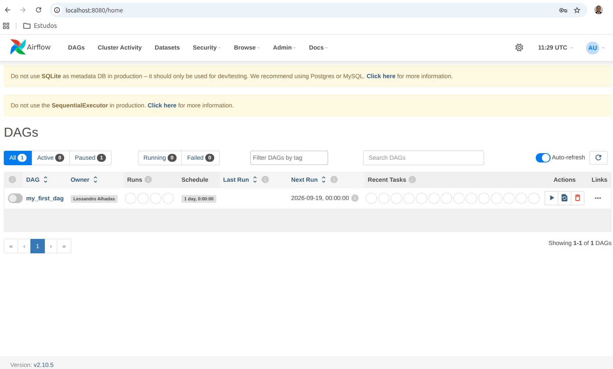
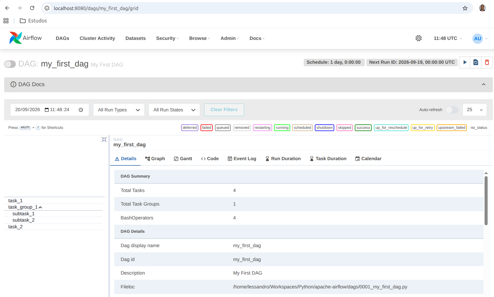

# 🚀 Apache Airflow: Hands-On & Boas Práticas

Repositório oficial de apoio à série de artigos sobre **Apache Airflow e Engenharia de Dados**.

Este projeto foi desenhado para demonstrar na prática a construção, execução e gerenciamento de pipelines de dados em um ambiente local controlado e reprodutível via ambiente virtual Python (`.venv`), sem dependência de containers Docker.

---

## 🛠️ Pré-requisitos

* **Python:** `3.11.13` (gerenciado via `pyenv`)
* **Sistema Operacional:** Linux / macOS / WSL2 (Windows)

---

## ⚙️ Configuração do Ambiente Local e Execução

Siga os passos abaixo no terminal para preparar o ambiente virtual, instalar as dependências e subir os serviços do Airflow.

### 1. Definir a Versão do Python
Garantir que a versão `3.11.13` esteja ativa no diretório do projeto:

```bash
pyenv install 3.11.13 --skip-existing
pyenv local 3.11.13
```

### 2. Criar e Ativar o Ambiente Virtual

```bash
python -m venv .venv
source .venv/bin/activate
```

### 3. Instalar as Dependências

```bash
pip install -r requirements.txt
```

### 4. Configurar Variáveis de Ambiente
Definir o diretório de trabalho do Airflow (AIRFLOW_HOME) e desabilitar o carregamento automático das DAGs de exemplo da ferramenta:

```bash
export AIRFLOW_HOME=$(pwd)/airflow_home
export AIRFLOW__CORE__LOAD_EXAMPLES=False
```
### 5. Inicializar o Banco de Dados

```bash
airflow db init
```
### 6. Configurar o Diretório de DAGs
Atualizar a propriedade dags_folder no arquivo de configuração do Airflow apontando diretamente para a pasta dags/ do projeto:

```bash
sed -i "s#dags_folder = .*#dags_folder = $(pwd)/dags#" $AIRFLOW_HOME/airflow.cfg
```

### 7. Criar Usuário Administrador
⚠️ **Aviso de Conformidade e Segurança:** As credenciais configuradas abaixo são simplificadas para viabilizar a execução local do projeto. Em ambientes produtivos, é indispensável a adoção de políticas fortes de senha, integração com provedores de identidade (IdP) e restrição de acessos administrativos.

```bash
airflow users create \
    --username admin \
    --firstname Admin \
    --lastname User \
    --role Admin \
    --email seu_email@seu_provedor.com \
    --password admin
```

### 8. Iniciar os Serviços do Airflow
Executar o modo standalone (inicia o Scheduler e o Webserver simultaneamente no mesmo terminal):

```bash
airflow standalone
```

ℹ️ **Nota sobre o Modo Standalone:** Ao executar o comando airflow standalone, é normal visualizar no terminal o alerta "Using the in-memory storage for tracking rate limits...". \
Este repositório foi projetado com foco em exercícios e testes locais simplificados (utilizando o banco SQLite e executor local). Embora abordemos conceitos do básico ao avançado ao longo da série, ambientes de produção exigem bancos relacionais dedicados (PostgreSQL/MySQL), gerenciamento de estado persistente e executores distribuídos (Celery/Kubernetes).

### 9. Acesse o Console
Abra o navegador em http://localhost:8080 e faça login com as credenciais cadastradas no Passo 7. \
Na página inicial irá aparecer a lista de DAGs.



E ao clicar no nome da DAG você vai para página de detalhes:


### 10. Reiniciar os serviços
Para uma reinicialização correta, execute:

```bash
export AIRFLOW_HOME=$(pwd)/airflow_home
export AIRFLOW__CORE__LOAD_EXAMPLES=False
airflow standalone
```